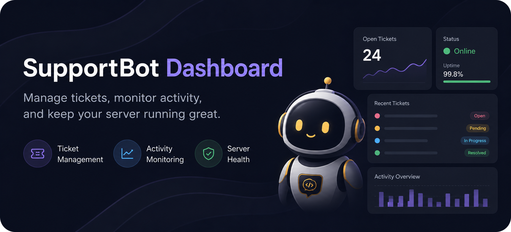

<p align="center">
  <a href="https://github.com/C-h-a-r/SupportBot-Dashboard">
    
  </a>
</p>

<h1 align="center">SupportBot Dashboard</h1>

<p align="center">
  <strong>An unofficial fork of <a href="https://github.com/Emerald-Services/SupportBot">Emerald-Services/SupportBot</a> with a built-in, self-hosted web dashboard.</strong>
</p>

<p align="center">
  <a href="https://opensource.org/licenses/MIT">
    
  </a>
  <a href="https://github.com/discordjs/discord.js">
    
  </a>
  <a href="https://nodejs.org/">
    
  </a>
  <a href="https://github.com/Emerald-Services/SupportBot">
    
  </a>
</p>

<p align="center">
  <a href="#about">About</a> ·
  <a href="#features">Features</a> ·
  <a href="#requirements">Requirements</a> ·
  <a href="#getting-started">Getting started</a> ·
  <a href="#dashboard-access">Dashboard access</a> ·
  <a href="#configuration">Configuration</a> ·
  <a href="#addons">Addons</a> ·
  <a href="#development">Development</a> ·
  <a href="#upstream--credits">Upstream & credits</a> ·
  <a href="#license">License</a>
</p>

---

## About

This repository is a **community fork** of [SupportBot](https://github.com/Emerald-Services/SupportBot) — the open-source Discord support/ticket bot by [Emerald Services](https://emeraldsrv.dev). It is **not** affiliated with or endorsed by Emerald Services.

What this fork adds is a **self-hosted dashboard**: a modern web UI and REST API that run in the **same Node process** as the bot. You configure tickets, messages, commands, AI settings, addons, and more from the browser instead of editing YAML by hand. The API starts immediately on launch, so the dashboard stays reachable even while the bot is connecting or restarting.

If you only need the original bot without the dashboard, use the [official SupportBot repository](https://github.com/Emerald-Services/SupportBot).

## Features

### Self-hosted dashboard

| Area | What you get |
|------|----------------|
| **Overview** | Live stats — servers, members, open/closed tickets, module setup status, RAM/CPU/uptime |
| **Visual config editors** | Edit `supportbot`, ticket panel, commands, messages, and AI config with form fields instead of raw YAML |
| **Discord pickers** | Choose channels, roles, and categories from dropdowns when configuring the bot (no copy-pasting IDs) |
| **Guild health** | Warnings if the bot is in the wrong server or extra guilds; quick link to fix `GuildId` or leave stray servers |
| **Logs** | Browse Output, Warn, and Error logs from the dashboard |
| **Transcripts** | View saved ticket HTML transcripts |
| **Notifications** | In-app alerts for bot restarts, update checks, and installs |
| **Settings** | Check for dashboard updates and apply them from the UI |
| **Users & roles** | Invite staff via Discord OAuth; assign owner, admin, editor, viewer, or custom per-page permissions |
| **Addons** | Browse and install addons from the [official Addons repo](https://github.com/Emerald-Services/Addons); edit addon configs in the sidebar like other config files |

### Bot & API (unchanged upstream behaviour, plus improvements)

- Full **SupportBot v26** ticket system, slash commands, AI assistant, and addon support
- **Discord OAuth** login for the dashboard (no shared API secret in the browser)
- **API key** (`SecretKey` in `api.yml`) still works for automation and scripts
- Config saves can **restart the Discord bot** while keeping the dashboard and API online
- Timeouts and caching so the UI does not hang when Discord or GitHub is slow

## Requirements

| Component | Version |
|-----------|---------|
| **Node.js** | 22.x (matches [SupportBot 8.x](https://github.com/Emerald-Services/SupportBot)) |
| **discord.js** | 14.x (installed via `package.json`) |
| **Discord bot** | Application with bot token and required intents |
| **Discord OAuth app** | For dashboard login (optional but recommended) |

You need a machine or VPS that can run Node and reach Discord’s API (and GitHub, if you use in-dashboard updates or the addon marketplace).

## Getting started

### 1. Clone and install

```bash
git clone https://github.com/C-h-a-r/SupportBot-Dashboard.git
cd SupportBot-Dashboard
npm install
```

### 2. Configure the bot

Edit `Configs/supportbot.yml`:

- Set `General.Token` to your bot token
- Set `General.GuildId` to your Discord server ID
- Enable addons if you use them: `General.Addons.Enabled: true`

Other YAML files in `Configs/` can stay at defaults until you open the dashboard.

### 3. Configure the API & dashboard

Edit `Configs/api.yml`:

```yaml
API:
  Enabled: true
  Port: 3000
  SecretKey: "generate-a-long-random-string"
  OAuth:
    Enabled: true
    ClientId: "YOUR_DISCORD_APP_CLIENT_ID"
    ClientSecret: "YOUR_DISCORD_APP_CLIENT_SECRET"
    RedirectUri: "http://localhost:3000/api/auth/discord/callback"
    OwnerUserIds:
      - "YOUR_DISCORD_USER_ID"
```

**Discord Developer Portal**

1. Create an application at [discord.com/developers/applications](https://discord.com/developers/applications)
2. Under **OAuth2 → Redirects**, add your callback URL(s). If users may sign in over **both** HTTP and HTTPS, register **both** (same host/path, different protocol), e.g. `http://bot.example.com/api/auth/discord/callback` and `https://bot.example.com/api/auth/discord/callback`.
3. Use the same app’s **Client ID** and **Client Secret** in `api.yml`
4. Put your Discord user ID in `OwnerUserIds` for full dashboard access

Set `RedirectUri` to your usual URL (host and path). By default, `UseRequestOrigin` keeps the **same protocol** as the page you opened (http vs https). Behind a reverse proxy, set `TrustProxy: 1` so forwarded `X-Forwarded-Proto` is respected.

### 4. Start the bot

```bash
npm start
```

When startup succeeds you should see:

- `[Dashboard] API listening on http://localhost:3000`
- Discord bot login and slash command registration

Open **http://localhost:3000** in your browser and sign in with Discord.

The web UI is shipped as static files in `public/dashboard/` (included in this repository). You do not need a separate frontend build step.

> **Tip:** On first run, invite the bot to your server with the permissions SupportBot needs. Set `General.GuildId` to that server’s ID so channel/role pickers and guild health checks work.

## Dashboard access

| Method | Use case |
|--------|----------|
| **Discord OAuth** | Normal use — open the site, click **Continue with Discord**, sign in as an owner or invited user |
| **Bearer token** | Scripts and automation — `Authorization: Bearer <SecretKey>` on `/api/*` routes |

Owners listed in `api.yml` (`OwnerUserIds`) always have full access. Additional users can be added under **Users** in the dashboard with granular permissions per config file and page.

## Configuration

| File | Purpose |
|------|---------|
| `Configs/supportbot.yml` | Bot token, guild, staff roles, ticket channels, embed colours, etc. |
| `Configs/ticket-panel.yml` | Ticket panel layout and buttons |
| `Configs/commands.yml` | Enable/disable slash commands |
| `Configs/messages.yml` | User-facing message strings |
| `Configs/supportbot-ai.yml` | AI assistant settings |
| `Configs/api.yml` | Dashboard port, session secret, OAuth |
| `Addons/Configs/*` | Per-addon config (after installing from **Addons** page) |

Most of these are editable from the sidebar under **Tickets & support**, **Community**, **Server control**, and **Addons**.

## Addons

1. Open **Addons** in the dashboard (or install manually into `Addons/` as in the [upstream docs](https://github.com/Emerald-Services/Addons))
2. Click **Install** on an addon from the marketplace — files are copied into `Addons/` and `Addons/Configs/`, then the bot restarts
3. Edit the addon’s config from the **Addons** section in the left sidebar (same editor as core configs)
4. Ensure `General.Addons.Enabled` is `true` in bot config

Official addon list: [github.com/Emerald-Services/Addons](https://github.com/Emerald-Services/Addons)

## Upstream & credits

- **Original project:** [Emerald-Services/SupportBot](https://github.com/Emerald-Services/SupportBot) — MIT license, ticket bot for Discord
- **Official addons:** [Emerald-Services/Addons](https://github.com/Emerald-Services/Addons)
- **Community:** [Emerald Discord](https://emeraldsrv.dev/discord) · [Wiki](https://github.com/Emerald-Services/SupportBot/wiki)

This fork is maintained independently. For bugs in **core ticket/command behaviour** that also exist upstream, consider reporting to the [official repo](https://github.com/Emerald-Services/SupportBot/issues). For **dashboard-specific** issues, use this repository’s issues.

## License

Released under the [MIT License](https://opensource.org/licenses/MIT), same as upstream SupportBot.
